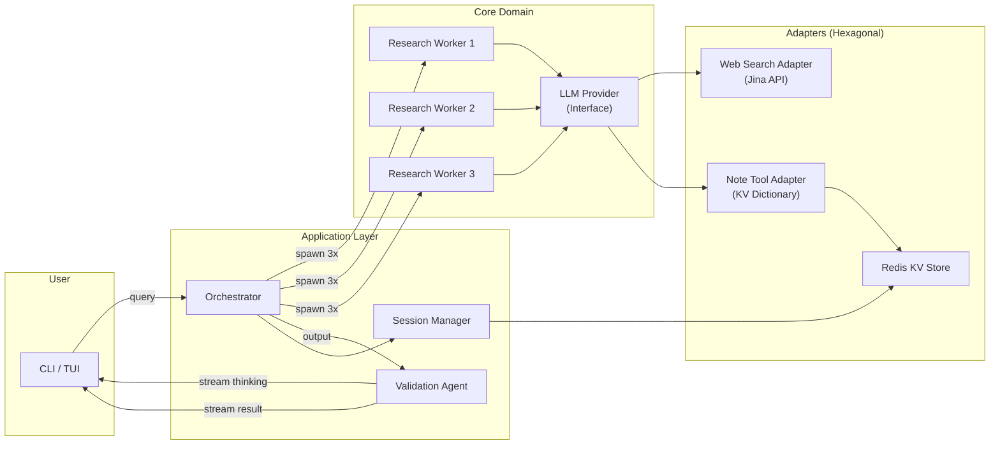
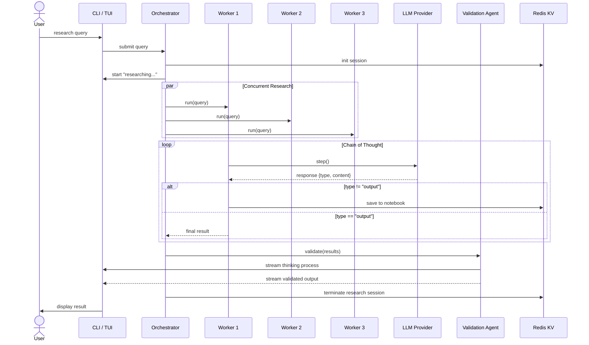
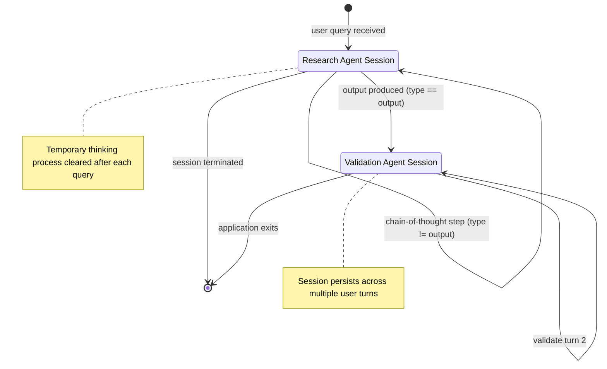
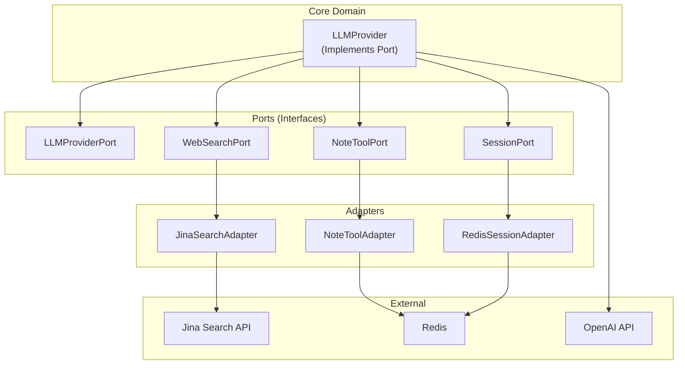

# Architecture Diagrams: Self-Consistency Research Agent

**Author:** Paige (Technical Writer)
**Date:** 2026-07-07

---

## 1. Architecture Pipeline

---

## 2. Request Flow (Sequence)

---

## 3. Session Lifecycle (State)

---

## 4. Hexagonal Architecture (Context)

