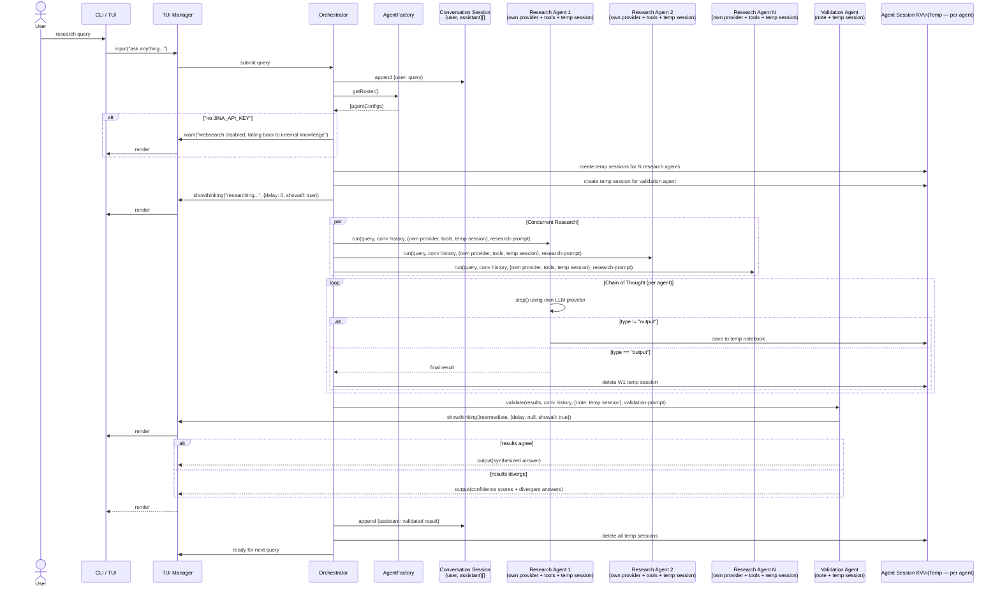
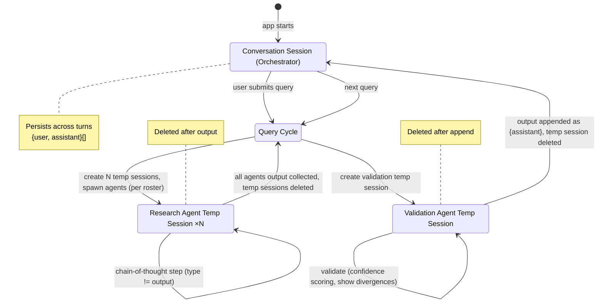
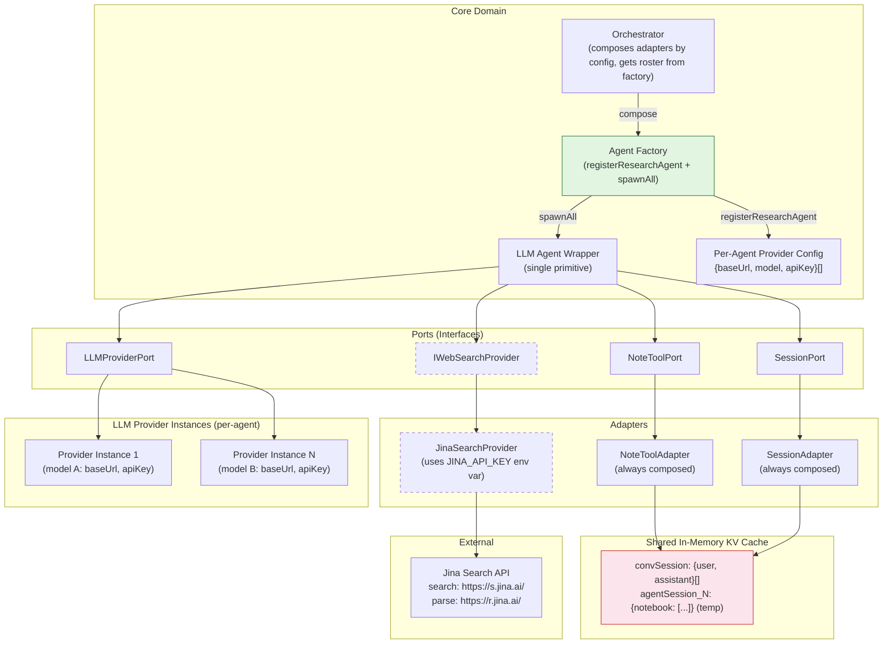
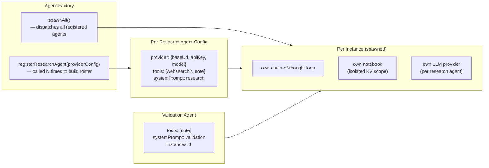

# Architecture Diagrams: Self-Consistency Research Agent

**Author:** Paige (Technical Writer)
**Date:** 2026-07-07

---

## 1. Architecture Pipeline

```mermaid
flowchart LR
    subgraph User["User"]
        TUI["CLI / TUI"]
    end

    subgraph App["Application Layer"]
        Orchestrator["Orchestrator"]
        Session["Session Manager"]
        TUIMgr["TUI Manager\nshowthinking()\noutput()\ninput()\nwarn()"]
    end

    subgraph AgentInstance["Per-Agent Instance (spawned × N)"]
        direction TB
        CoT["Chain-of-Thought Loop"]
        Notebook["Own Notebook\n(per-agent KV scope)"]
    end

    subgraph LLM_Provider["LLM Providers (per-agent)"]
        direction TB
        P1["Research Agent 1\nprovider: config{baseUrl, model, apiKey}"]
        P2["Research Agent N\nprovider: config{baseUrl, model, apiKey}"]
    end

    subgraph Adapters["Adapters (Hexagonal — composed by config)"]
        WebSearch["JinaSearchProvider\n(Jina API) — optional"]
    end

    subgraph Storage["Shared In-Memory KV Cache"]
        KVCache["convSession: {user, assistant}[]<br/>── per query ──<br/>agentSession_1: {notebook: [...]}<br/>agentSession_N: {notebook: [...]}<br/>valSession: {notebook: [...]}<br/>── all temp sessions deleted after completion ──"]
    end

    TUI --> TUIMgr
    TUIMgr -->|input()| Orchestrator

    Orchestrator -->|owns| Session
    Session -->|reads/writes| KVCache

    Orchestrator -->|compose adapters\nby config| Adapters
    Orchestrator -->|spawn from roster + temp sessions| AgentInstance
    Orchestrator -->|delete temp sessions after done| KVCache
    Orchestrator -->|append output to convSession| KVCache

    CoT -.->|if composed| WebSearch
    CoT ..-> P1
    CoT ..-> P2

    CoT -->|save/read| Notebook
    Notebook -->|temp agent session| KVCache

    CoT -->|stream thinking/output| TUIMgr
    Orchestrator -->|warn()| TUIMgr
    TUIMgr -->|render| TUI
```

---

## 2. Request Flow (Sequence)



---

## 3. Session Lifecycle (State)



---

## 4. Hexagonal Architecture (Context)



---

## 5. Agent Configuration Matrix



---

## 6. TerminalPresenter — Optional Styling Component

`TUIManager` optionally composes an `ITerminalPresenter` at construction. When Chalk is available, `ChalkPresenter` provides colored output; when absent, `PlainPresenter` writes directly to terminal without styling. The interface is swappable for any chalk-like library.

```mermaid
classDiagram
    class ITerminalPresenter {
        <<Interface>>
        +render(opts: {color?: string; bgcolor?: string; opacity?: number}) void
        +success(text: string) void
        +fail(text: string) void
        +warning(text: string) void
    }

    class ChalkPresenter {
        -chalk: Chalk
        +render(opts: {color?: string; bgcolor?: string; opacity?: number}) void
        +success(text: string) void
        +fail(text: string) void
        +warning(text: string) void
    }

    class PlainPresenter {
        +render(opts: {color?: string; bgcolor?: string; opacity?: number}) void
        +success(text: string) void
        +fail(text: string) void
        +warning(text: string) void
    }

    class TUIManager {
        -chalk: string
        -currentThinking: string
        -presenter: ITerminalPresenter
        +showthinking(text: string, opts: string) void
        +clear() void
        +truncateLength() number
        +output(text: string) void
        +input(placeholder: string) string
        +useroutput() void
    }

    ITerminalPresenter <|.. ChalkPresenter : chalk implementation
    ITerminalPresenter <|.. PlainPresenter : fallback (no styling)
    TUIManager --> ITerminalPresenter : optional composition

    style ITerminalPresenter fill:#e3f2fd,stroke:#1565c0
    note for TUIManager "presenter is optional — TUIManager\ngracefully degrades when absent"
```
