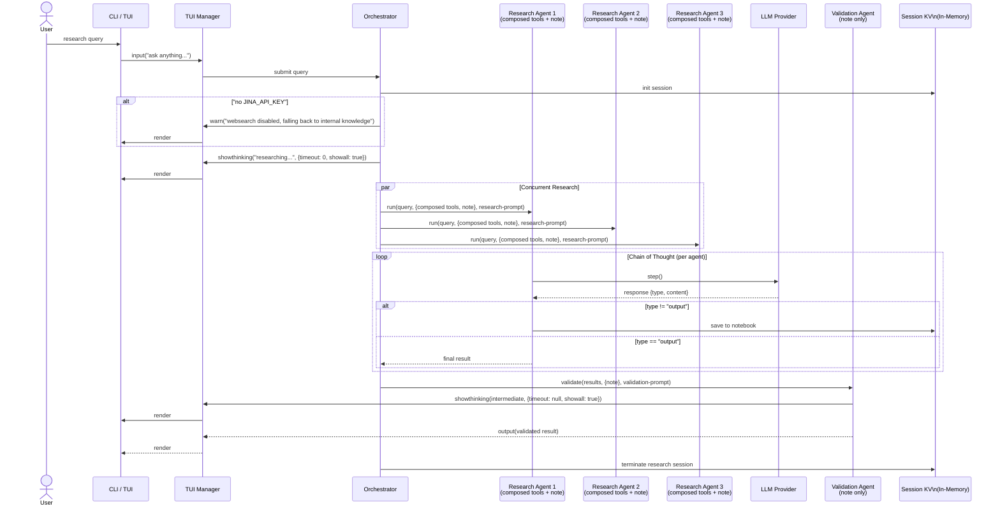
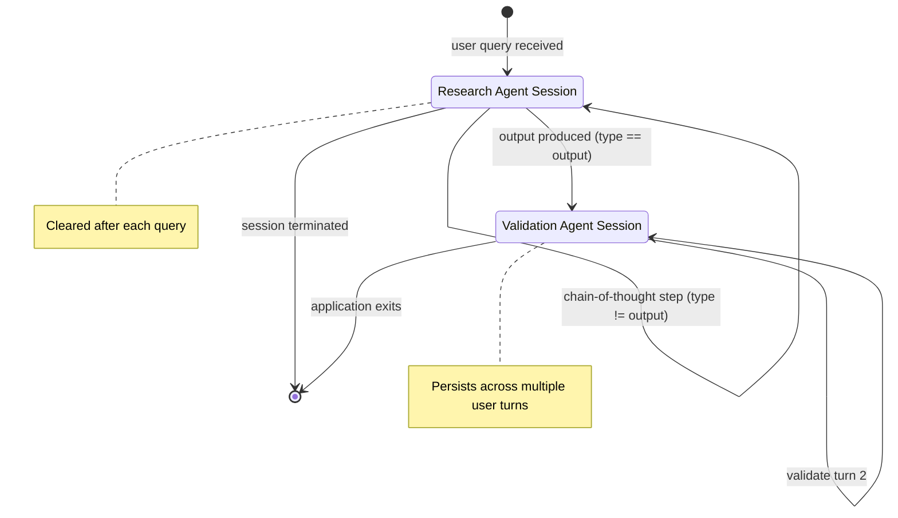
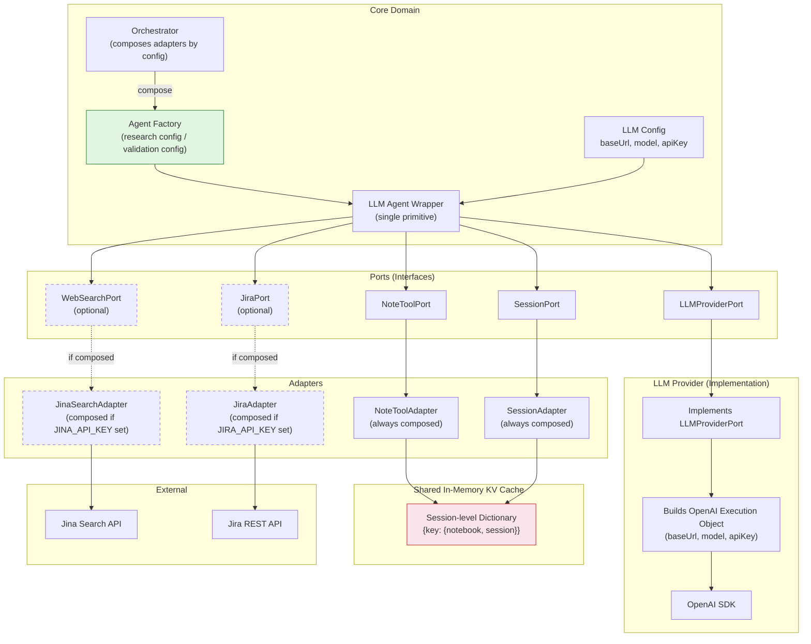
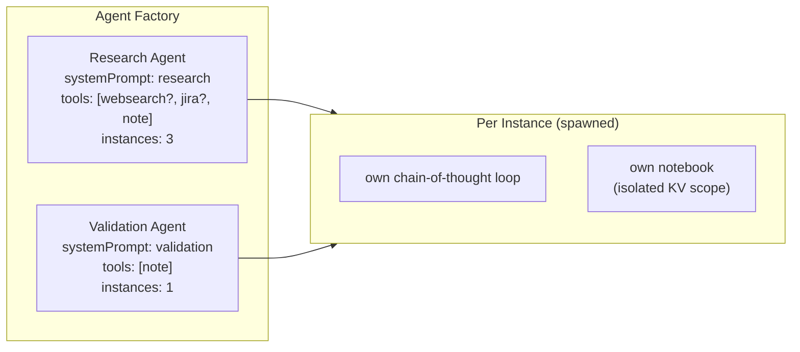

# Architecture Diagrams: Self-Consistency Research Agent

**Author:** Paige (Technical Writer)
**Date:** 2026-07-07

---

## 1. Architecture Pipeline

```mermaid
flowchart LR
    subgraph User["User"]
        TUI["CLI / TUI"]
    end

    subgraph App["Application Layer"]
        Orchestrator["Orchestrator"]
        Session["Session Manager"]
        TUIMgr["TUI Manager\nshowthinking()\noutput()\ninput()\nwarn()"]
    end

    subgraph AgentInstance["Per-Agent Instance (spawned × N)"]
        direction TB
        CoT["Chain-of-Thought Loop"]
        Notebook["Own Notebook\n(per-agent KV scope)"]
    end

    subgraph LLM_Provider["LLM Provider"]
        direction TB
        Config["config: baseUrl, model, apiKey"]
        Exec["OpenAI Execution Object"]
    end

    subgraph Adapters["Adapters (Hexagonal — composed by config)"]
        WebSearch["Web Search Adapter\n(Jina API) — optional"]
        JiraAdapter["Jira Adapter\n(Jira REST API) — optional"]
    end

    subgraph Storage["Shared In-Memory KV Cache"]
        KVCache["{sessionKey: {<br/>  notebook_agent1: [...],<br/>  notebook_agent2: [...],<br/>  session: {...}<br/>}}"]
    end

    TUI --> TUIMgr
    TUIMgr -->|input()| Orchestrator

    Orchestrator -->|compose adapters\nby config| Adapters
    Orchestrator -->|spawn 3x, tools=composed| AgentInstance
    Orchestrator -->|spawn 1x, tools=composed| AgentInstance

    CoT -.->|if composed| WebSearch
    CoT -.->|if composed| JiraAdapter
    CoT --> Config
    Config --> Exec

    CoT -->|save/read| Notebook
    Notebook --> KVCache
    Orchestrator --> Session
    Session --> KVCache

    CoT -->|stream thinking/output| TUIMgr
    Orchestrator -->|warn()| TUIMgr
    TUIMgr -->|render| TUI
```

---

## 2. Request Flow (Sequence)



---

## 3. Session Lifecycle (State)



---

## 4. Hexagonal Architecture (Context)



---

## 5. Agent Configuration Matrix


