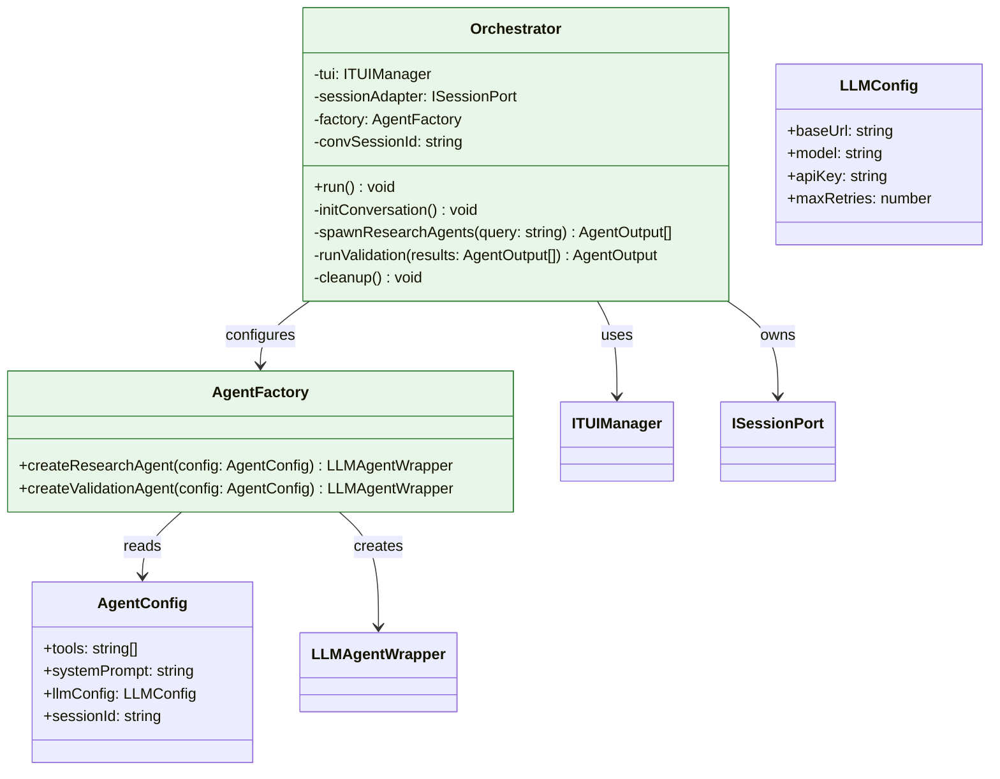
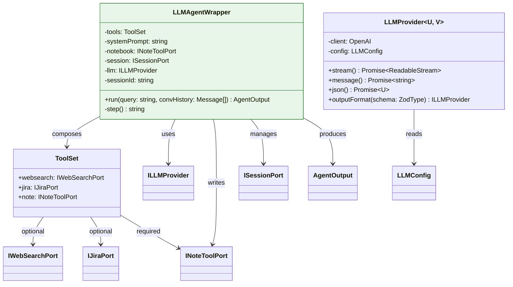
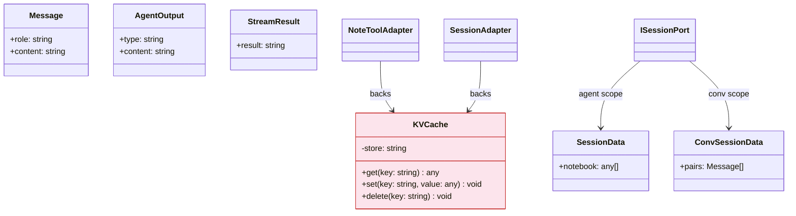

# Class Diagram: Self-Consistency Research Agent

## 1. Ports & Adapters — Hexagonal Boundary

Interfaces (ports) on the left, their concrete implementations (adapters) on the right. Optional adapters use dashed lines — they are composed only when the corresponding API key is present.

```mermaid
classDiagram
    class ILLMProvider~U, V~ {
        <<Interface>>
        +stream() Promise~ReadableStream~
        +message() Promise~string~
        +json() Promise~U~
        +outputFormat(schema: ZodType) ILLMProvider
    }

    class ITUIManager {
        <<Interface>>
        +showthinking(text: string, opts: string) void
        +clear() void
        +truncateLength() number
        +output(text: string) void
        +input(placeholder: string) string
        +useroutput() void
    }

    class IWebSearchPort {
        <<Interface>>
        +search(query: string) string
        +parse(url: string) string
    }

    class IJiraPort {
        <<Interface>>
        +query(params: string) any
    }

    class INoteToolPort {
        <<Interface>>
        +save(key: string, value: any) void
        +read(key: string) any
    }

    class ISessionPort {
        <<Interface>>
        +init(id: string) void
        +get(id: string) SessionData
        +set(id: string, data: SessionData) void
        +delete(id: string) void
    }

    class IConsistencyProtocol {
        <<Interface>>
        +participate(provider: ILLMProvider) void
        +submission() any
        +evaluation() string
    }

    class LLMProvider~U, V~ {
        -client: OpenAI
        -config: LLMConfig
        +stream() Promise~ReadableStream~
        +message() Promise~string~
        +json() Promise~U~
        +outputFormat(schema: ZodType) ILLMProvider
    }

    class JinaSearchAdapter {
        -apiKey: string
        +search(query: string) string
        +parse(url: string) string
    }

    class JiraAdapter {
        -apiKey: string
        -baseUrl: string
        +query(params: string) any
    }

    class NoteToolAdapter {
        -kvStore: KVCache
        +save(key: string, value: any) void
        +read(key: string) any
    }

    class SessionAdapter {
        -kvStore: KVCache
        +init(id: string) void
        +get(id: string) SessionData
        +set(id: string, data: SessionData) void
        +delete(id: string) void
    }

    class TUIManager {
        -chalk: string
        -currentThinking: string
        +showthinking(text: string, opts: string) void
        +clear() void
        +truncateLength() number
        +output(text: string) void
        +input(placeholder: string) string
        +useroutput() void
    }

    ILLMProvider <|.. LLMProvider : implements
    ITUIManager <|.. TUIManager : implements
    IWebSearchPort <|.. JinaSearchAdapter : implements
    IJiraPort <|.. JiraAdapter : implements
    INoteToolPort <|.. NoteToolAdapter : implements
    ISessionPort <|.. SessionAdapter : implements

    LLMAgentWrapper <|.. IConsistencyProtocol : implements

    style ILLMProvider fill:#e3f2fd,stroke:#1565c0
    style ITUIManager fill:#e3f2fd,stroke:#1565c0
    style IWebSearchPort fill:#e3f2fd,stroke:#1565c0
    style IJiraPort fill:#e3f2fd,stroke:#1565c0
    style INoteToolPort fill:#e3f2fd,stroke:#1565c0
    style ISessionPort fill:#e3f2fd,stroke:#1565c0
    style IConsistencyProtocol fill:#e3f2fd,stroke:#1565c0
```



---

## 2. Orchestrator & Factory — Lifecycle Management

The orchestrator coordinates the entire pipeline. It uses the TUI, owns the session, and delegates agent creation to the factory. The factory reads agent config and produces LLMAgentWrapper instances.



---

## 3. Agent Internals — Tool Composition

Every agent is the same `LLMAgentWrapper` primitive. What differs is its `ToolSet` — composed at factory time from configured adapters. Research agents get `websearch + jira + note`; validation agents get `note` only. The LLM provider is the single external dependency all agents share.



---

## 4. Storage & Data Models

A single in-memory `KVCache` backs both the session manager and per-agent notebooks. The orchestrator owns one `ConvSessionData` (persistent `{user, assistant}` pairs), while each agent gets a temp `SessionData` (isolated notebook). All temp sessions are deleted after query completion.



---

## Ports (Interfaces) — Quick Reference

| Interface | Methods | Purpose |
|-----------|---------|---------|
| `ILLMProvider<U,V>` | `stream()`, `message()`, `json()`, `outputFormat()` | LLM interaction; generic over input/output types |
| `ITUIManager` | `showthinking()`, `clear()`, `truncateLength()`, `output()`, `input()`, `useroutput()` | Terminal UI abstraction |
| `IWebSearchPort` | `search()`, `parse()` | Web search capability (optional) |
| `IJiraPort` | `query()` | Jira integration (optional) |
| `INoteToolPort` | `save()`, `read()` | Per-agent notebook KV |
| `ISessionPort` | `init()`, `get()`, `set()`, `delete()` | Session lifecycle |
| `IConsistencyProtocol` | `participate()`, `submission()`, `evaluation()` | Agent participation contract |

## Key Relationships

- **Orchestrator** owns the lifecycle: composes adapters, spawns agents, manages Conversation Session
- **AgentFactory** produces `LLMAgentWrapper` instances with different configs (research vs validation)
- **LLMAgentWrapper** is the single reusable primitive — takes a `ToolSet` + `systemPrompt` and runs CoT
- **ToolSet** is composed at factory time based on environment config (optional adapters excluded when keys missing)
- **KVCache** is the shared in-memory store backing both `NoteToolAdapter` and `SessionAdapter`

---

## 5. TerminalPresenter — Optional Styling

`TUIManager` optionally composes an `ITerminalPresenter`. Chalk is the primary implementation; when unavailable, `PlainPresenter` writes text directly without ANSI codes. The interface is swappable for any chalk-like library.

```mermaid
classDiagram
    class ITerminalPresenter {
        <<Interface>>
        +render(opts: {color?: string; bgcolor?: string; opacity?: number}) void
        +success(text: string) void
        +fail(text: string) void
        +warning(text: string) void
    }

    class ChalkPresenter {
        -chalk: Chalk
        +render(opts: {color?: string; bgcolor?: string; opacity?: number}) void
        +success(text: string) void
        +fail(text: string) void
        +warning(text: string) void
    }

    class PlainPresenter {
        +render(opts: {color?: string; bgcolor?: string; opacity?: number}) void
        +success(text: string) void
        +fail(text: string) void
        +warning(text: string) void
    }

    class TUIManager {
        -chalk: string
        -currentThinking: string
        -presenter: ITerminalPresenter
        +showthinking(text: string, opts: string) void
        +clear() void
        +truncateLength() number
        +output(text: string) void
        +input(placeholder: string) string
        +useroutput() void
    }

    ITerminalPresenter <|.. ChalkPresenter : chalk implementation
    ITerminalPresenter <|.. PlainPresenter : fallback (no styling)
    TUIManager --> ITerminalPresenter : optional composition

    style ITerminalPresenter fill:#e3f2fd,stroke:#1565c0
    note for TUIManager "presenter is optional"
```

Append to Ports table:

| `ITerminalPresenter` | `render()`, `success()`, `fail()`, `warning()` | Optional terminal styling; swappable for any chalk-like library |
