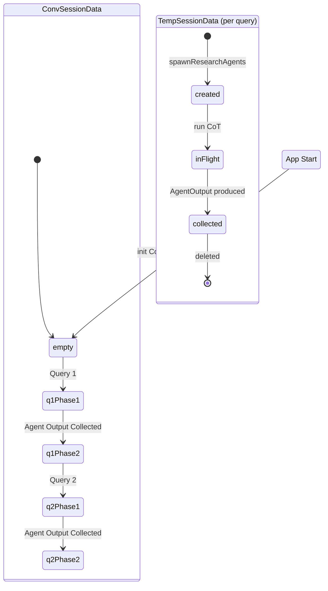

# Object Diagram: Runtime Snapshot During Query Execution

## 1. Runtime Instance Snapshot

An object (`instanceName:ClassName`) diagram showing a live state when the user submits a query. N research agents are in-flight (3 shown as example), each with their own LLM provider, the validation agent hasn't been spawned yet, and the single `KVCache` holds both the conversation session and N temp agent notebooks.

```mermaid
classDiagram
    class orch:Orchestrator {
        convSessionId = session-abc123
        tui = tui
        sessionAdapter = sAdapter
        factory = f
    }

    class tui:TUIManager {
        chalk = Chalk
        currentThinking = researching...
    }

    class sAdapter:SessionAdapter {
        kvStore = cache
    }

    class nAdapter:NoteToolAdapter {
        kvStore = cache
    }

    class f:AgentFactory {
        roster = [rConfig1, rConfig2, rConfig3]
    }

    class r1:LLMAgentWrapper {
        sessionId = temp-r1
        tools = websearch+note
        systemPrompt = sherlock
    }

    class r2:LLMAgentWrapper {
        sessionId = temp-r2
        tools = websearch+note
        systemPrompt = sherlock
    }

    class r3:LLMAgentWrapper {
        sessionId = temp-r3
        tools = websearch+note
        systemPrompt = sherlock
    }

    class v1:LLMAgentWrapper {
        sessionId = temp-val
        tools = note
        systemPrompt = athena
    }

    class prov1:LLMProvider {
        config = {baseUrl: A, model: gpt-4o, apiKey: key1}
    }

    class prov2:LLMProvider {
        config = {baseUrl: B, model: claude-4, apiKey: key2}
    }

    class prov3:LLMProvider {
        config = {baseUrl: C, model: gemini-3, apiKey: key3}
    }

    class cache:KVCache {
        store = conv plus N temp
    }

    class jina:JinaSearchProvider {
        apiKey = present
    }

    orch --> tui
    orch --> sAdapter
    orch --> f
    f --> r1 : spawnAll creates
    f --> r2 : spawnAll creates
    f --> r3 : spawnAll creates
    f --> v1 : created later

    r1 --> prov1
    r2 --> prov2
    r3 --> prov3

    r1 --> nAdapter
    r2 --> nAdapter
    r3 --> nAdapter

    r1 --> jina
    r2 --> jina
    r3 --> jina

    sAdapter --> cache
    nAdapter --> cache
```

---

## 2. Session State Transitions

A state diagram showing how the `ConvSessionData` and `TempSessionData` objects evolve across a full two-query lifecycle. Temp sessions are created per query and garbage-collected after the agent produces its `AgentOutput`.



---

## Object Table

| Object | Class | State | Notes |
|--------|-------|-------|-------|
| `orch` | `Orchestrator` | `convSessionId = "session-abc123"` | Root coordinator |
| `tui` | `TUIManager` | showing "researching..." | Chalk-based terminal |
| `sAdapter` | `SessionAdapter` | backed by `cache` | Manages all sessions |
| `nAdapter` | `NoteToolAdapter` | backed by `cache` | Per-agent notebook store |
| `f` | `AgentFactory` | `roster = [rConfig1, rConfig2, rConfig3]` | Manages agent roster via register/spawnAll |
| `r1, r2, r3` | `LLMAgentWrapper` | each with own `sessionId` | Research agents in-flight, each with own provider |
| `v1` | `LLMAgentWrapper` | not yet created | Validation agent (pending) |
| `prov1, prov2, prov3` | `LLMProvider` | each with unique `{baseUrl, model, apiKey}` | Per-agent providers for cross-model diversity |
| `cache` | `KVCache` | N temp sessions + 1 conv session | Shared in-memory store |
| `jina` | `JinaSearchProvider` | composed (API key present) | Optional — uses JINA_API_KEY env var |

## 3. TerminalPresenter — Runtime Styling State

When Chalk is available, `tui` composes `ChalkPresenter` for styled output. When absent, `PlainPresenter` is used. The object below shows the Chalk-composed state.

```mermaid
classDiagram
    class tui:TUIManager {
        chalk = Chalk
        currentThinking = researching...
        presenter = pres
    }

    class pres:ChalkPresenter {
        chalk = chalk instance
    }

    tui --> pres : optional composition
```

---

## Session State Transitions (ASCII View)

```
App Start           Query 1             Query 1             Query 2
                    Research Phase      Validation Phase
┌──────────┐       ┌──────────────┐    ┌──────────────┐    ┌──────────────┐
│ conv     │──────>│ conv         │───>│ conv         │───>│ conv         │
│ session  │       │ session      │    │ session      │    │ session      │
│ []       │       │ [{user,q1}]  │    │ [{u,q1},{a,  │    │ [{u,q1},{a,  │
└──────────┘       ├──────────────┤    │   answer1}]  │    │   ans1},     │
                   │ temp-r1      │    └──────────────┘    │ {u,q2}]      │
                   │ temp-r2      │                        ├──────────────┤
                   │ temp-r3      │                        │ temp-r1'     │
                   └──────────────┘                        │ temp-r2'     │
                         │                                 │ temp-r3'     │
                         ▼                                 └──────────────┘
                   All temp sessions                            │
                   deleted after output                         ▼
                                                           Deleted after
                                                           output (new cycle)
```
