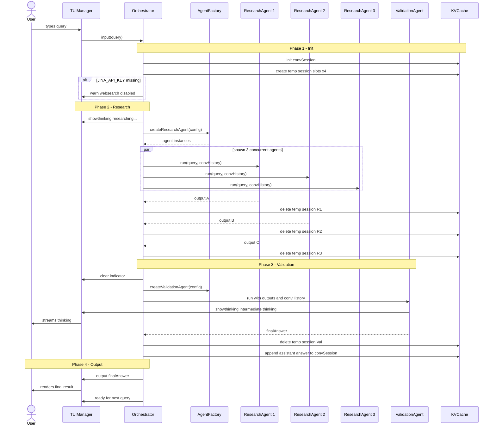

# S1 — Query Lifecycle Sequence

**Scope:** User submits query → orchestrator lifecycle → agent creation → validation → output
**Actors:** User, Orchestrator, AgentFactory, LLMAgentWrapper (×3), ValidationAgent, KVCache

---

## Phase Breakdown

| Phase | Action | Temp Sessions |
|-------|--------|---------------|
| **Init** | App starts or new query arrives; conv session created/loaded; 4 temp session slots allocated | 0 active |
| **Research** | 3 agents spawned concurrently; each writes CoT to its temp session; sessions deleted on output | 3 → 0 |
| **Validation** | 1 agent synthesizes results via majority-vote; thinking streamed live; session deleted after append | 1 → 0 |
| **Output** | Final answer rendered; orchestrator awaits next query | 0 |
