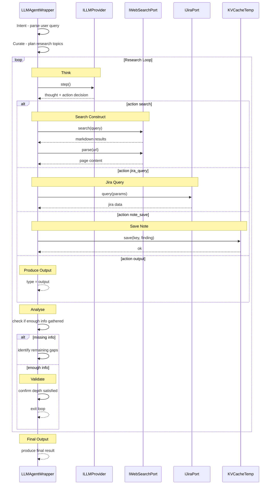

# S2 — Agent Internal Chain-of-Thought Loop

**Scope:** Inside a single LLMAgentWrapper instance — the 10-phase research loop per sherlock prompt
**Actors:** LLMAgentWrapper, ILLMProvider, ToolSet (websearch, jira, note), KVCache (temp session)

---



## Loop State Machine

```
┌──────────┐     ┌──────────┐     ┌────────────┐
│  Intent  │────>│  Curate  │────>│    Loop    │
└──────────┘     └──────────┘     └─────┬──────┘
                                        │
                                   ┌────▼──────┐
                                   │   Think   │
                                   └────┬──────┘
                                        │
                              ┌─────────┼──────────┐
                              │         │          │
                         ┌────▼──┐ ┌───▼───┐ ┌───▼────┐
                         │Search │ │Jira   │ │Note    │
                         └───┬───┘ └───┬───┘ └───┬────┘
                             │         │          │
                         ┌───▼─────────▼──────────▼──┐
                         │       Analyse             │
                         └───┬─────────┬──────────┬──┘
                             │         │          │
                        ┌────▼──┐ ┌───▼────┐ ┌───▼─────┐
                        │Gap    │ │Enough  │ │Output   │
                        │found  │ │ info   │ │produced │
                        └───┬───┘ └───┬────┘ └───┬─────┘
                            │         │          │
                            └──►Loop──┘          │
                                      ┌──────────▼──────┐
                                      │  Final Output   │
                                      │  {type: output} │
                                      └─────────────────┘
```

## CoT Tool Access by Agent Type

| Tool | Research Agent | Validation Agent |
|------|---------------|------------------|
| `websearch` | ✅ (if composed) | ❌ |
| `jira` | ✅ (if composed) | ❌ |
| `note` | ✅ | ✅ |
